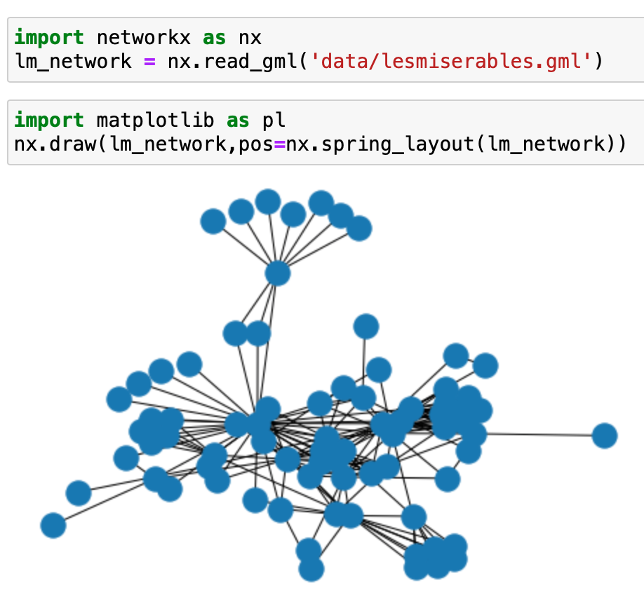
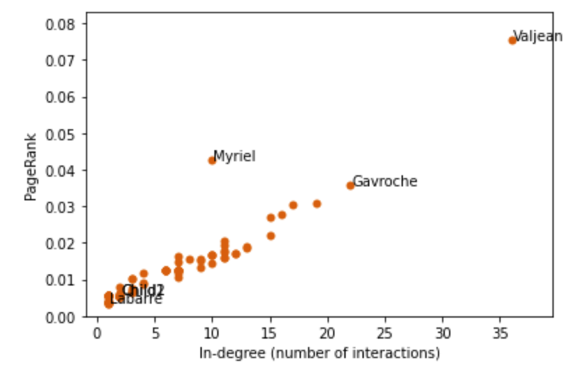

# GraphTheory_LesMis
Applying Graph Theory to the the weighted network of co appearances of characters in Victor Hugo's novel "Les Miserables". Finding the dominant eigenvector to find the most "popular" characters or important nodes.

#Graph of Les Miserables network 

#Final result

